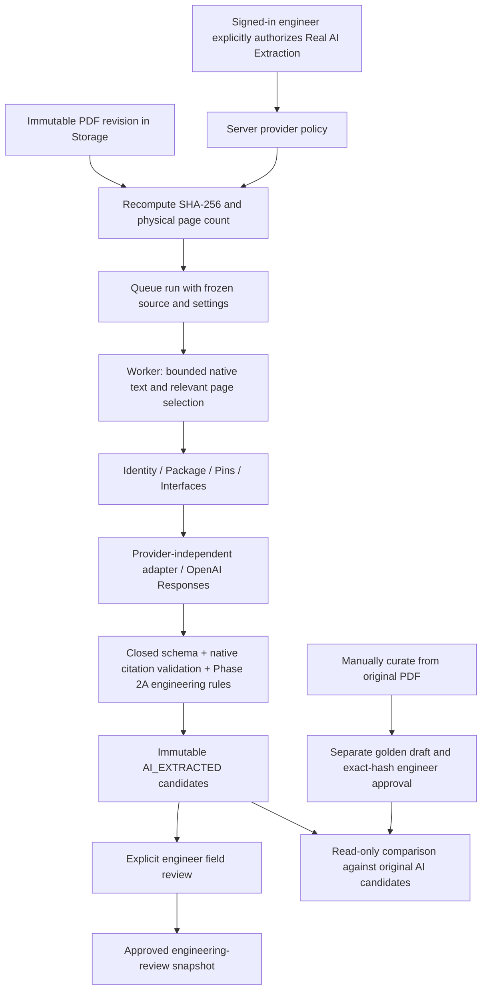

# Phase 2B — real datasheet AI extraction

Implementation for engineering review, based on approved Phase 2A commit
`862f43bfceadfc130d3a60fe4899bf9a406f85a6`. Phase 1 tag `v0.1.0` is unchanged.
No real CC1120 extraction or accuracy measurement has been performed by this implementation.
All automated provider tests use fabricated documents and mocked HTTP responses.

## Architecture and trust boundary



Implementation lives in `backend/app/ai/`:

| Module | Responsibility |
| --- | --- |
| `config.py` | Default-deny external policy, server model/key, bounded extraction settings |
| `providers/base.py` | Provider-independent candidate request/result protocol |
| `providers/openai_provider.py` | OpenAI Responses HTTP adapter, no tools/files/automatic retries |
| `parsing.py` | Storage reads, hash check, physical pages, bounded native text and selection |
| `prompts.py`, `wire.py` | Versioned focused prompts and strict transport subset of engineering-extraction/0.1 |
| `extraction.py` | Four passes, reference context, evidence checks, immutable pass audit |
| `golden.py` | Manual golden curation, approval and deterministic read-only evaluation |

The engineering service chooses an adapter through a registry. Provider calls do not
live in the engineering repository or original document metadata service. Synthetic
extraction still accepts only its exact fabricated fixture. Real extraction accepts
uploaded revisions with usable native text and the configured policy authorization.

AI never supplies provenance, an actor identity, or a human approval state. The server
creates provenance; the wire schema allows only AI_EXTRACTED. Unknown/missing wire
properties, unsupported engineering keys, wrong revisions, missing evidence, malformed
responses and invalid engineering relationships fail publication atomically. No partial
field dataset is published after a failed pass. Raw provider output is not stored.
Existing immutable corrections, review sequence concurrency checks, approval hashes,
snapshot invalidation and unapproved-data gates remain in place. All PADS eligibility
remains false, including approved real-data snapshots. Retry creates a new independent run.

## Provider integration and provenance

Uses the fixed HTTPS OpenAI Responses endpoint with `text.format` JSON Schema,
`strict: true`, `store: false`, no tools, no file upload and no automatic HTTP retries.
See the official [Structured Outputs guide](https://developers.openai.com/api/docs/guides/structured-outputs).
Every object is closed and all properties required in the wire schema. Nullable values
express missing optional information. Local validation also enforces this shape rather
than trusting that the provider honored its schema. Model compatibility/account access
must be checked by the engineer when configuring a model; no model is silently selected.

Queued runs freeze provider, model identifier, pipeline/parser versions, prompt version
and combined prompt/schema SHA-256, settings and explicit transmission authorization.
The model/key are server-owned; clients cannot choose arbitrary endpoints or supply keys.
Each completed HTTP pass adds an immutable record containing request/response hashes,
prompt hash, API-reported model identifier/version when available, selected physical
pages, selected-text hash and parser truncation information. `run.provenance.passes`
and field provenance expose these records. Top-level model_version remains null when
there is no independent model-build version; API-returned identifiers are kept per pass.
Hashing proves which content was handled, not that a provider's model alias is immutable.

The frozen queued provenance and append-only pass records compose the existing public
provenance model. Candidate-set hashes cover that complete provenance. Failed locally
validated responses retain their pass hashes; transport/refusal failures retain the
queued configuration, attempted request hash and redacted pass error code. A response
hash is retained when a bounded response body was received; it is null for failures
without a captured body. No raw response or full error message is retained.
Credentials and Authorization headers are excluded from hashes and persistence.

Worker leases last 600 seconds. Provider connect timeout is 10 seconds and read/write
timeout 90 seconds; response bodies are capped at 2 MB. Crashed workers expire through
the existing lease mechanism and require an explicit retry. Cancellation stops later
passes and publication; it cannot recall text already sent in an in-flight request.
No provider call is made merely because a PDF is uploaded or a golden comparison runs.

## Native PDF preprocessing and focused passes

Read originals through Storage and verify SHA-256 every time. By default scan at most
200 physical pages (configurable up to 300), retaining at most 12,000 native characters
per page in worker memory. Decoded page content above 2 MB is rejected before text
extraction. There are no persisted full-text copies or parser cache files.
Pypdf decompression occurs before this decoded-content check; this is a bounded parser
output design, not an OS memory/time sandbox for hostile PDFs.

Score pages using pass-specific terms and boost page 1 for identity. Select at most
6 relevant pages and 40,000 characters per pass by default. API settings permit at most
10 pages, 20,000 characters/page and 60,000 characters/pass. Truncated page numbers are
visible in provenance. The algorithm scans all allowed pages, including trailing
mechanical sections, then sends only selected bounded text with physical page numbers.
Image-only/scanned PDFs fail with no provider call; OCR and reliable region extraction
are deferred. Relevant content beyond truncation/selection can be missed; review
selected page provenance and unresolved fields before changing bounds and retrying.

1. **Identity:** manufacturer, part number, description.
2. **Package:** requested package variant, family/type/code, lead count and count basis,
   exposed-pad presence, dimensions and pitch where supported.
3. **Pins:** number/name, electrical type/function, functional group, package linkage,
   explicit exposed-pad handling. Required slots stay present as unavailable when unknown.
4. **Interfaces:** kind/name/function and explicit pin memberships with roles/modes.

Later passes receive bounded earlier package/pin identifiers and relevant labels to
link entities. They do not receive the whole earlier response. The initial wire profile
uses primary_function and interface memberships for multiplexing; arbitrary
`alternate_function.*` keys remain supported by Phase 2A but are not emitted by this
closed transport vocabulary. The requested scope is copied exactly onto all entities;
variant facts still require PDF evidence. Scope text supplied by the user is not proof.

Every PRESENT claim needs actual text support on a selected physical page of the same
revision. Matching normalizes whitespace only. Region-only citations and OCR/VISION
locators are rejected for this native-text adapter. Presence of a quote proves location,
not its engineering interpretation; confidence is a self-report, visually separate
from engineer approval. Unknown values are NOT_FOUND or AMBIGUOUS, never guessed.
Existing count/reference/dimension validation may reject an incomplete pin table rather
than publish a dataset whose asserted count contradicts its rows.

## Schema migration and APIs

SQLite schema v3 backs up an existing v1/v2 database before migration using SQLite's
coherent backup API. Stop all backend/worker processes before upgrading. Migration
rebuilds extraction_runs only to allow `openai` alongside `synthetic`; every existing
column value is copied verbatim. All original triggers/indexes are recreated in the
same transaction, foreign keys checked before commit, and normal connections enforce
foreign keys. Original Phase 1 tables and uploaded PDF bytes are not rewritten.

New tables:

| Table | Data / mutability |
| --- | --- |
| `provider_passes` | Per-run/pass compact provenance JSON, insert only while RUNNING, no update/delete |
| `golden_manifests` | Revision-pinned manual expected data and hash, curation actor/time, single explicit approval transition; no content changes/deletes |

Evaluations are computed read-only and are not stored as duplicate candidate datasets.
Create a new golden draft to change expected data. Old approved references remain
auditable; this development workflow does not yet implement golden revocation.

| Endpoint under `/api/v1` | Purpose |
| --- | --- |
| GET `/engineering/provider-config` | Provider/model and enable/configured flags; no credentials |
| POST `/revisions/{id}/extraction-runs` | Existing synthetic request or explicit real request below |
| GET `/extraction-runs/{id}` | Status, candidates, evidence and full composed provenance |
| GET `/engineering/golden-schema` | Exact manual manifest JSON Schema |
| POST `/golden-references` | Import manual draft, requires `manually_curated_from_source: true` |
| GET `/revisions/{id}/golden-references` | List up to 100 references for this revision |
| GET `/golden-references/{id}` | Exact manifest, hash and approval metadata |
| POST `/golden-references/{id}/approval` | Expected hash + `reviewed_against_original_pdf: true` |
| GET `/golden-references/{id}/evaluations/{run_id}` | Compare approved golden with original succeeded AI run |

Every mutation uses the existing reviewer session and CSRF/origin checks. Existing
field review/correction, cancellation and approved-snapshot endpoints remain available.

Real run body:

```json
{
  "provider": "openai",
  "external_transmission_authorized": true,
  "settings": { "package_scope": "engineer-selected-package-variant" },
  "retry_of_run_id": null
}
```

Optional settings and hard bounds are documented by the API's generated OpenAPI schema.
UI uses displayed default bounds. For advanced bounds use authenticated API requests
with the same explicit transmission authorization; never put the API key in the request.

## Golden curation and evaluation semantics

`engineering-golden/0.1` pins manufacturer, part number, immutable source_revision_id,
the uploaded document_revision label, PDF SHA-256, physical page_count, package_scope,
optional source URL/retrieval date, curation_notes and manually authored entities.
Each entity has local_key/kind/scope_key and fields of **key, value, evidence** only.
There are no model confidence or model review statuses in expected fields. Evidence
uses the existing locator schema. All expected fields are populated and source-supported;
unknown expectations should not be asserted as facts. Required entity slots and Phase 2A
engineering rules are validated before accepting a draft and again at approval/evaluation.

An engineer must independently read the original PDF and compose this manifest. The
application cannot prove how a human authored text; separate attestation and exact-hash
approval record the accountable decision. There is deliberately no 'make golden from AI'
action. A production CC1120 golden manifest is not included, and no PDF is downloaded.
Keep drafts under ignored `data/engineering/`. Git-manage a small derived reference only
after a separate explicit engineering review and decision to publish it.

Comparison ignores model-generated local IDs. Identity has one semantic address;
package uses scope; pins use scope/number; interfaces use scope/kind/name; memberships
use their interface/pin addresses and role/mode. References resolve to semantic addresses.
Ambiguous duplicate addresses cause an explicit error rather than silently overwrite rows.
Only exact strings/types match; mm decimal formatting is normalized. Name/designator
aliases are not guessed. A differently named interface can count as missing plus extra.

Each field row is MATCH, MISMATCH, MISSING or EXTRA. Unavailable actual values count
as missing against expected values; unavailable optional extras are not invented values.
Evidence is measured separately per expected field: same revision/page and expected
quote contained in the candidate quote after whitespace normalization. Quote matching
does not judge engineering meaning. Extra fields produce extra evidence rows.

Identity, Package, Pins, Interfaces and Evidence each report matches/expected, coverage
(present expected fields/expected fields), mismatches, missing and extras. Counters use
**field claims, not pin rows**. Wrong/missing/invented totals exclude the evidence category
to avoid double counting. No single overall accuracy percentage is produced. An empty
category has null coverage. Results include golden/candidate hashes and comparison version.
Measurements always use immutable original AI fields, even after human corrections or
approvals; they never mutate AI fields or golden content.

## First real CC1120 run — exact manual procedure

1. Stop old backend and worker processes. In `C:\workspace\EngineeringKnowledgeHub`,
   run `powershell -ExecutionPolicy Bypass -File scripts\bootstrap.ps1 -PortableNode`
   if dependencies are not already installed. Back up the current database and PDF
   storage together. Start-up migrates the database and keeps the prior-version backup.
2. Set up the local reviewer if necessary:
   `powershell -ExecutionPolicy Bypass -File scripts\setup-reviewer.ps1`.
   Use your own credentials; the hash file stays ignored. Do not enter the API key here.
3. In **each** backend and worker PowerShell terminal, set matching local configuration:

   ```powershell
   cd C:\workspace\EngineeringKnowledgeHub
   $env:EKH_EXTERNAL_AI_ENABLED = 'true'
   $env:EKH_OPENAI_MODEL = Read-Host 'OpenAI model identifier supporting strict Structured Outputs'
   $secureApiKey = Read-Host 'OpenAI API key' -AsSecureString
   $env:OPENAI_API_KEY = [System.Net.NetworkCredential]::new('', $secureApiKey).Password
   Remove-Variable secureApiKey
   ```

   This prompts without echoing the key or placing a literal key in shell history.
   Keys still exist in the process environment. Do not commit .env; it is not auto-loaded.
   Enablement defaults to false if omitted. To block selected revision IDs set, for example,
   `$env:EKH_AI_DENIED_REVISIONS = '12,18'` in both processes. Restart them to apply changes.
4. Start backend: `powershell -ExecutionPolicy Bypass -File scripts\start-backend.ps1`.
   Start worker in its configured terminal:
   `powershell -ExecutionPolicy Bypass -File scripts\start-worker.ps1`.
   In a third terminal start frontend:
   `powershell -ExecutionPolicy Bypass -File scripts\start-frontend.ps1`.
   Open `http://127.0.0.1:5173`. Keys are never needed in the frontend environment.
5. Obtain the **engineer-selected official Texas Instruments CC1120 datasheet** yourself.
   Register/select the component and upload it through Documents. Enter a precise
   document title/revision/date. Record the official retrieval URL/date. Do not use an
   automatically fetched latest PDF and do not commit the original to Git.
6. Open Engineering / AI Analysis, sign in, and select that exact uploaded revision.
   Choose **Real AI Extraction**. Check the displayed provider/model. Enter the exact
   package variant scope you intend to evaluate, based on the PDF. Review displayed
   limits and the external-transmission checkbox. Click **Start Real AI Extraction**.
   This is the first operation that authorizes paid external processing of selected text.
7. Wait for the local worker. Inspect run status, selected pages/provenance, every
   identity/package/pin/interface field, source links/snippets and unavailable values.
   Open the original PDF at each cited physical page. Confidence is not approval.
   Record reasons and explicitly approve/reject fields. For corrections use the existing
   correction API; this minimal UI does not yet provide a correction editor. Failed runs
   show redacted error codes; fix configuration/scope/bounds and explicitly retry as a new
   run. Do not infer correctness merely from SUCCEEDED.
8. Independently curate expected data from the original PDF into a local JSON file under
   `data/engineering/`. Use the **Golden JSON schema** link and the description above.
   Pin the uploaded revision ID/label, exact hash and physical page count from the run,
   add official retrieval metadata, and write source-supported expected fields manually.
   Do not copy AI output to establish expected values. No CC1120 expected facts are supplied here.
9. In **Golden Reference vs AI Extraction**, expand import, paste your manually curated
   manifest, attest its independent source curation, and import a draft. Expand and read
   the exact stored manifest and hash. Compare it with the original PDF, check the review
   acknowledgment, then choose **Approve golden reference**.
10. Choose **Compare original AI candidates**. Review category denominators, coverage,
    wrong/missing/invented counts and every MATCH/MISMATCH/MISSING/EXTRA row, including
    Evidence. Save the read-only evaluation JSON from the API if needed under ignored
    runtime storage. Only after this actual engineer-reviewed test may CC1120 accuracy
    be reported. Approved snapshots remain engineering-review-only; no PADS generation.

When finished, stop processes and remove local shell credentials with
`Remove-Item Env:OPENAI_API_KEY`; set `EKH_EXTERNAL_AI_ENABLED` to `false` before restarting
for offline use. Do not automatically start Phase 2C.

## Verification and limitations

Run `powershell -ExecutionPolicy Bypass -File scripts\test.ps1`. It runs all retained
Phase 1/2A tests, Phase 2B mocked provider/migration/evaluation tests, lint, frontend tests
and TypeScript/production build. Mocked tests explicitly reject real HTTP transports;
CI never needs an API key, provider credits, network model calls or vendor datasheets.

Known limits: local single-user deployment, native text only, heuristic page selection,
one package scope per golden/snapshot, field-level exact comparisons, no OCR/vision,
no real CC1120 accuracy result, and no electrical/register/PADS/footprint extraction.
Provider retention policies still apply to transmitted text even with `store: false`.
Changing server model/prompt/parser after queuing causes a safe failure and explicit retry.
Policy changes are loaded on process startup; configure backend and worker consistently.


### Automated acceptance result — 2026-09-08

`scripts/test.ps1` passed on the final implementation:

- Backend: 91 passed (all 63 retained Phase 1/2A cases plus 28 Phase 2B cases).
- Ruff: passed.
- Frontend: 9 passed (all 7 retained cases plus real-transmission and golden-review cases).
- TypeScript check and Vite production build: passed.
- `git diff --check`: passed.

Two existing dependency deprecation warnings were emitted by FastAPI/Starlette's
test client; no test failed. Phase 2B cases include strict output rejection, evidence,
provider timeout/HTTP/refusal/malformed/oversized responses, explicit retry without
approval inheritance, provenance persistence, policy disable/deny/cancel, parser bounds,
scanned PDF rejection, golden approval/hash pinning, comparison classifications,
correction-independent measurement, semantic ID matching, populated v2 audit migration,
and ignored credentials/runtime data. No real API credits or CC1120 facts were used.


### Worker console diagnostics

Failed `work_once()` runs emit a single JSON error event to the worker console (stderr).
Fields: `event`, `run_id`, frozen `provider`/`model`, `current_pass`, `stage`,
`exception_class`, and `sanitized_error_message`. Before/after a focused pass,
`current_pass` is null; synthetic runs use `synthetic`. Stages distinguish policy,
preprocessing, page selection, provider request, pass audit, evidence validation,
candidate assembly/validation and publication. Progress context is local to the invocation;
it is never persisted or reused by another run.

Only exact application-owned diagnostic messages are emitted. Pydantic failures report
bounded allowlisted field paths and error types, never input, message context or values.
Unknown dynamic exceptions use a generic reason. No exception traceback/chaining,
Authorization headers, API keys, raw provider responses or datasheet text are serialized.
Model identifiers are taken from frozen run configuration, bounded and filtered.
Existing DB failure codes, summaries, UI responses, immutable records and retries are unchanged.
